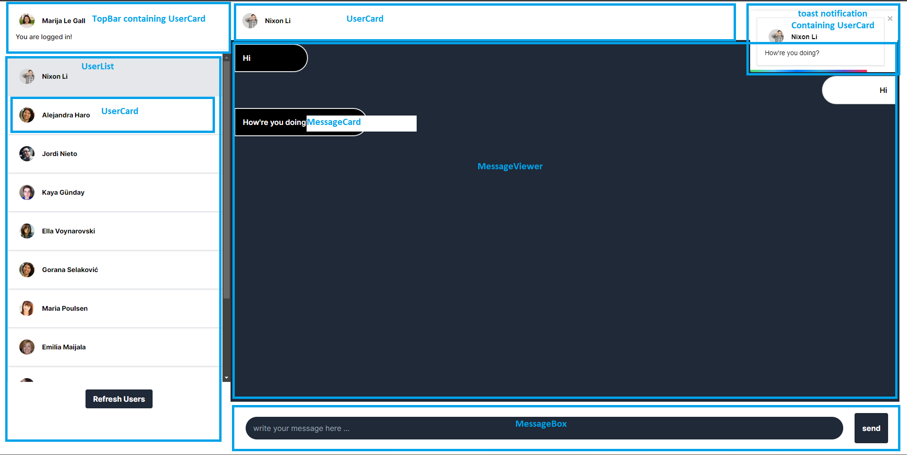

# DOCUMENTATION

## Table of Contents

1. [Introduction](#introduction)
2. [Assumptions](#assumptions)
3. [Technical decisions](#technical-decisions)
4. [Project folder structure](#project-folder-structure)
5. [Project logical structure](#project-logical-structure)
   1. [Project data structure](#project-data-structure)
   2. [Project communication structure](#project-communication-structure)
   3. [Project component structure](#project-component-structure)
6. [Implemented features](#implemented-features)
7. [Implemented Improvements](#implemented-improvements)
8. [Possible improvements](#possible-improvements)
   1. [QC improvements](#qc-improvements)
   2. [UX improvements](#ux-improvements)
   3. [Technical improvements](#technical-improvements)
9. [Conclusion](#conclusion)

## Introduction

This is a simple single-page website showcasing a fake chat app that allows chatting between multiple tabs/browser windows.

users can sign in with random name and image, and start sending messages to other browser tabs/windows.

The app is built using React and TailwindCSS, and uses [LocalStorage](https://developer.mozilla.org/en-US/docs/Web/API/Window/localStorage) to store the messages and user data. and [BroadcastChannel](https://developer.mozilla.org/en-US/docs/Web/API/BroadcastChannel) to send messages between tabs/windows.

## Assumptions

1. The user is not required to sign up or sign in with any credentials.
2. Security is not a concern. So storing the messages and user data in the browser's local storage is fine.
3. The app is a fake chat app, so it's fine to have all data in the device's memory while the app is running, in a real world scenario we would have to store the messages in a database and fetch them when needed. or fetch only user-specific messages.

## Technical decisions

### 1. Using [Vite](https://vitejs.dev/) instead of [Create React App](https://create-react-app.dev/)

#### Vite is a much faster alternative to CRA, and it's much easier to configure and customize. it also supports [React Fast Refresh](https://reactnative.dev/docs/fast-refresh) out of the box. This came at the cost of making configuring this app to be tested with [jest](https://jestjs.io/) a bit more difficult

### 2. Using [pre-commit](https://pre-commit.com/) to run [eslint](https://eslint.org/) and [prettier](https://prettier.io/) before each commit

### 3. Using the browser's [BroadcastChannel](https://developer.mozilla.org/en-US/docs/Web/API/BroadcastChannel) to send messages between tabs/windows

#### This is a simple and easy way to send messages between tabs/windows, and it's supported by all major browsers. although a better way would be to identify individual user tabs and only send messages to them instead of broadcasting to all tabs/windows. this is a much simpler implementation and it's fine for this use case

### 4. Using [LocalStorage](https://developer.mozilla.org/en-US/docs/Web/API/Window/localStorage) to store the messages and user data

#### This is again a technical choice to simplify the implementation (could have used [IndexedDB](https://developer.mozilla.org/en-US/docs/Web/API/IndexedDB_API/Using_IndexedDB) but i wasn't sure if that was allowed). in a real world scenario I would probably opt for using a BAAS (Backend as a service) like [Firebase](https://firebase.google.com/) or [Supabase](https://supabase.io/) to store the messages and user data

## Project folder structure

The project is structured like almost any other react app, but here are some insights:

1. The `src` folder contains all the source code
2. The `config.js` file contains all the app's configuration variables from the environment variables
3. The `components` folder is separated into a `shared` folder that contains all the shared components, other components are on the top level. in a bigger project with more components, these components would be grouped into folders based on their functionality or where they are used.
4. The `pages` folder contains all the pages in the app, in this case there is only two pages, `Chat` and `Login`
5. The `types` folder contains all the typescript types used in the app
6. The `api` folder contains all the code related to the app's [fake] API, in this case we have two [fake] APIs for the `messages` and `users` endpoints
7. The `broadcast` folder contains all the code related to the app's [BroadcastChannel](https://developer.mozilla.org/en-US/docs/Web/API/BroadcastChannel) implementation

## Project logical structure

### Project data structure

we have two major data stores in this project:

1. `messages` which is an object containing all the messages sent by all users.
   The store object has the following shape:

   ```ts
   {
       [senderId: string]: {
           [recieverId: string]: ChatMessage[];
       };
   }
   ```

   each message is stored in an object with the following structure:

   ```ts
   {
     id: string;
     body: string;
     type: SENT | RECIEVED;
   }
   ```

   `senderId` is the currently logged in user's id, and `recieverId` is the id of the user currently being chatted with. The messages array `ChatMessage[]` is an array of all the messages exchanged between both users. this way we can easily get all the messages between two users. and both users have a complete local history of both sent and recieved messages.

   So, If we have a `user1`, `user2`, and a `user3`, the `messages` object can look something like this:

   ```json
   {
     "user1Id": {
       "user2Id": [
         {
           "id": "message1Id",
           "body": "message1Body",
           "type": "SENT"
         },
         {
           "id": "message2Id",
           "body": "message2Body",
           "type": "RECIEVED"
         }
       ],
       "user3Id": [
         {
           "id": "message3Id",
           "body": "message3Body",
           "type": "SENT"
         }
       ]
     },
     "user2Id": {
       "user1Id": [
         {
           "id": "message1Id",
           "body": "message1Body",
           "type": "RECIEVED"
         },
         {
           "id": "message4Id",
           "body": "message4Body",
           "type": "SENT"
         }
       ]
     },
     "user3Id": {
       "user1Id": [
         {
           "id": "message3Id",
           "body": "message3Body",
           "type": "RECIEVED"
         }
       ]
     }
   }
   ```

2. `users` which is an object containing all the users in the app. the store object has the following shape:

   ```ts
   {
       [userId: string]: User;
   }
   ```

   each user is stored in an object with the following structure:

   ```ts
   {
     id: string;
     firstName: string;
     lastName: string;
     profilePicture: string;
   }
   ```

   The User data is fetched from the [randomuser.me](https://randomuser.me/) API, and the `profilePicture` is a link to the user's profile picture.

### Project communication structure

Since the project runs completely locally. The only communication channel used in this project is the [BroadcastChannel](https://developer.mozilla.org/en-US/docs/Web/API/BroadcastChannel) API.

the app uses one channel, the messages sent over the channel (not to be confused with chat messages) have the following structure:

```ts
{
  type: string;
  message: ChannelMessage | User;
}
```

the `message` field can be either a `ChannelMessage` in case the event is that a user has sent a message, or a `User` object in the event of a new user login.

the `ChannelMessage` object has the following structure:

```ts
{
  id: string;
  body: string;
  from: User;
  to: User;
}
```

When a chat message is sent, it is broadcasted to all open tabs, and it's each tab's responsibilty to check if the message is for them or not. this is done by checking if the `to` field of the message is the currently logged in user.

### Project component structure

The project is structured in a way that makes it easy to add new features and components. the main components are:

1. `Chat` component which is the main component that renders the chat page. it's responsible for rendering the user list, the chat messages viewer, and the chat input.
2. `Login` component which is the main component that renders the login page. it's responsible for rendering the new user button and the user list in case you want to log in as an existing user.

Below is a screenshot of the app's chat page broken down into it's components:



And here is a screenshot of the app's login page broken down into it's components:


The project doesn't use any state management library like [Redux](https://redux.js.org/) or [MobX](https://mobx.js.org/README.html) since the app is very simple and doesn't have a lot of state to manage.

I'm using [Context API](https://reactjs.org/docs/context.html) to manage the app's state. the app has one context, ChatContext, which is has the following shape:

```ts
    {
        currentUser?: User;
        users?: UserMap;
        setUsers?: React.Dispatch<React.SetStateAction<UserMap>>;
        messages?: MessageMap;
    };
```

## Implemented features

All Required features are implemented

## Implemented Improvements

1. Presistend user/messages data
2. Notifications
3. Allowing login as existing user

## Possible improvements

### QC improvements

#### 1. Add unit/snapshot tests

I had planned to add at least a sample of unit/snapshot tests but I ran out of time as i ran into issues with [setting up jest with vite](https://jestjs.io/docs/getting-started#using-vite). But I would have really liked if i had had more time to add some tests.

#### 2. Add better error handling

for the current app scope and implementation, error handling is not necessary (no real API for example, just using browser APIs). But Implementing an erorr handling mechanism at least for the `api` folder would be a good idea.

### UX improvements

#### 1. Add a loading state

Currently, the app doesn't have a loading state, this is because loading the messages from `localStorage` is almost instant. However, it is better to have a loading spinner design along with loading state this can be fixed by adding a loading state to the app. similar to how it's implemented in the [`LinkPreview` component](../src/components/LinkPreview/index.tsx)

#### 2. Add a way to delete messages

Currently, there is no way to delete messages. this can be fixed by adding a delete button to each message. and when a user deletes a message, the message is deleted from the `messages` object in the `ChatContext` and from the `localStorage` as well.

#### Add search functionality for users

Currently, there is no way to search for users. this can be fixed by adding a search input to the user list. and when a user searches for a user, the user list is filtered based on the search query.

#### Add search functionality for messages

Currently, there is no way to search for messages. this can be fixed by adding a search input to the chat messages viewer. and when a user searches for a message, the messages list is filtered based on the search query.

#### Add a way to logout

Currently, there is no way to logout except by refreshing the page. this can be fixed by adding a logout button to the chat page. and when a user logs out, the `currentUser` is set to `undefined` in the `ChatContext` and the user is redirected to the login page.

#### Add a way to create a user profile

Currently, there is no way to create a user profile. this can be fixed by adding a form to the login page that allows the user to create a new user profile. and when a user creates a new profile, the user is redirected to the chat page and the `currentUser` is set to the newly created user in the `ChatContext`.

### Technical improvements

A lot of the technical decisions made here were infleuenced by the time constraint and the inability to use external libraries. but here are some improvements that can be made:

#### 1. Use a BAAS like [supabase](https://supabase.io/) or [firebase](https://firebase.google.com/)

Using a BAAS would make the app more secure and scalable. and it would allow us to add more features like user authentication and authorization, and user profiles. it would also allow us to actually support chatting between multiple devices instead of just multiple tabs/windows.

#### 2. Use a state management library like [Redux](https://redux.js.org/) or [MobX](https://mobx.js.org/README.html)

This would give all the logic for updating local state a place to live. if the project is to be scaled, this would be a good idea.

#### 3. Use a router library like [react-router](https://reactrouter.com/)

Currently there is no router since the app only has two pages and no actual authentication functionality (showing the chat view simple when the current user is selected/created). but if the app is to be scaled, this would be a must.

#### 4. Use [IndexedDB](https://developer.mozilla.org/en-US/docs/Web/API/IndexedDB_API/Using_IndexedDB) instead of [LocalStorage](https://developer.mozilla.org/en-US/docs/Web/API/Window/localStorage)

IndexedDB is a better alternative to LocalStorage since it's more performant and it's not synchronous. but it's a bit more complicated to use and it's not supported by all browsers.

## Conclusion

For any further questions, check the [feature demo loom video](https://www.loom.com/share/2be49476b6704deea26e0bcdcd4d6308?sid=90ac3883-6aeb-4d2f-a442-711f48c2dde5) or contact me at [aymanf.sherief@gmail.com](mailto:aymanf.sherief@gmail.com)
